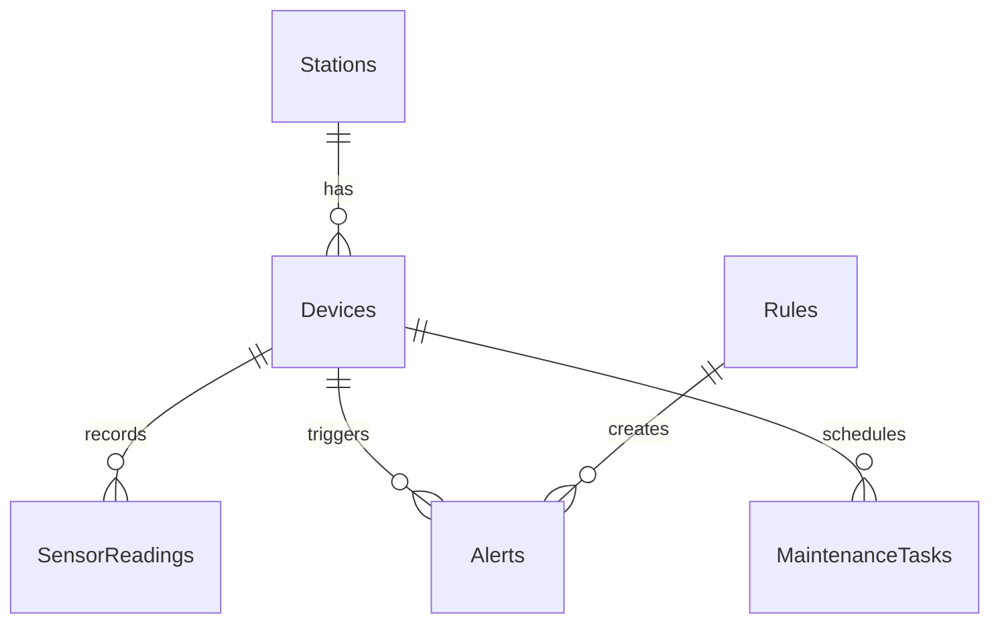

# Hướng dẫn Cơ sở Dữ liệu & Lưu trữ (Local & Cloud)

Dự án **StationOS** kết hợp giữa lưu trữ dữ liệu tại biên (Edge Database) phục vụ truy vấn tốc độ cao tại trạm và dữ liệu đám mây (Cloud Database) để phục vụ quản lý tổng thể.

---

## 1. Cấu trúc Cơ sở Dữ liệu cục bộ (Edge Database Schema)

Hệ thống tại trạm sử dụng **PostgreSQL** (môi trường sản xuất) hoặc **SQLite** (môi trường phát triển/thử nghiệm) được quản lý qua **Entity Framework Core**.

### Các thực thể dữ liệu chính:

#### A. Bảng `Stations` (Thông tin trạm)
*   `Id` (Guid, PK): Định danh duy nhất của trạm biến áp.
*   `Name` (String): Tên trạm (ví dụ: Trạm 110kV Cầu Giấy).
*   `Location` (String): Tọa độ địa lý hoặc địa chỉ trạm.

#### B. Bảng `Devices` (Thiết bị & Tủ điện)
*   `Id` (Guid, PK): Định danh thiết bị.
*   `StationId` (Guid, FK): Thuộc trạm nào.
*   `Name` (String): Tên thiết bị (ví dụ: Tủ 471).
*   `Type` (String): Loại thiết bị (`plc_s7`, `camera_thermal`, `modbus_tcp`).
*   `Status` (String): Trạng thái kết nối (`online`, `offline`).
*   `Config` (String/JSON): Cấu hình kết nối phần cứng, ví dụ:
    `{"ip":"192.168.1.50","rack":0,"slot":1,"db":32,"enableHealthScore":true}`

#### C. Bảng `SensorReadings` (Số liệu đo lường chuỗi thời gian)
*   `Id` (Long, PK): Định danh bản ghi số liệu.
*   `DeviceId` (Guid, FK): Thuộc thiết bị nào.
*   `PointId` (String): Định danh điểm cảm biến (ví dụ: `nhiet_do_pha_1`, `phong_dien`).
*   `Value` (Double): Trị số cảm biến đo được.
*   `Time` (DateTime): Thời điểm ghi nhận (UTC).

#### D. Bảng `Alerts` (Nhật ký cảnh báo)
*   `Id` (Guid, PK)
*   `DeviceId` (Guid, FK)
*   `RuleId` (Guid, FK, Nullable): Rule kích hoạt cảnh báo này.
*   `PointId` (String): Tên cảm biến kích hoạt cảnh báo.
*   `Level` (String): Mức độ (`alarm`, `warning`).
*   `Status` (String): Trạng thái (`open` - đang mở, `acked` - kỹ sư đã nhận, `resolved` - đã phục hồi).
*   `Message` (String): Nội dung thông báo lỗi.
*   `CreatedAt` / `ResolvedAt` (DateTime)

#### E. Bảng `Rules` (Luật cấu hình cảnh báo)
*   `Id` (Guid, PK)
*   `Name` (String)
*   `DeviceId` (Guid, FK)
*   `PointId` (String): Điểm cảm biến cần áp dụng luật.
*   `Threshold` (Double): Ngưỡng kích hoạt cảnh báo.
*   `ClearValue` (Double): Ngưỡng tự động phục hồi cảnh báo.
*   `Actions` (String/JSON): Danh sách hành động (Ví dụ: `[{"type": "health", "penalty": 15}, {"type": "email", "to": "admin@station.com"}]`).

#### F. Bảng `SystemSettings` (Cài đặt hệ thống & Trạng thái tính toán)
*   `Key` (String, PK): Định danh cấu hình (Ví dụ: `health_{deviceId}`).
*   `Value` (String/JSON): Giá trị lưu trữ (Ví dụ JSON chứa điểm sức khỏe đo được gần nhất và mức cảnh báo tương ứng).

---

## 2. Kế hoạch lưu trữ dữ liệu chuỗi thời gian (Time-series) lâu dài

Do cảm biến PLC gửi dữ liệu liên tục (quét mỗi giây), dung lượng bảng `SensorReadings` sẽ tăng rất nhanh. Để bảo vệ ổ cứng máy chủ trạm:

1.  **Dọn dẹp tự động (Retention Policy)**: 
    *   Hệ thống duy trì một Worker dọn dẹp chạy định kỳ (mỗi tuần một lần).
    *   Dữ liệu thô độ phân giải cao (quét từng giây) chỉ lưu trữ trong **30 ngày** gần nhất để xem đồ thị chi tiết.
2.  **Tổng hợp số liệu (Downsampling)**:
    *   Dữ liệu cũ hơn 30 ngày sẽ được chạy thuật toán lấy giá trị trung bình/lớn nhất/nhỏ nhất theo từng giờ, gom lại thành các bản ghi tổng hợp (Hourly Aggregates) để phục vụ tra cứu báo cáo năm, giảm 99% kích thước lưu trữ.
    *   Xóa toàn bộ dữ liệu thô cũ hơn 30 ngày sau khi đã tổng hợp.

---

## 3. Đồng bộ hóa về Supabase Cloud

Khi `CloudSyncWorker` đồng bộ dữ liệu:
*   Bảng `Alerts` được đồng bộ thời gian thực để cấp quản lý nắm bắt ngay các sự cố thiết bị tại trạm.
*   Bảng `SensorReadings` được đồng bộ theo giờ dưới dạng dữ liệu đã được gom nhóm (Downsampled data) để tiết kiệm băng thông mạng 3G/4G của trạm và hạn chế dung lượng lưu trữ trên Cloud.
